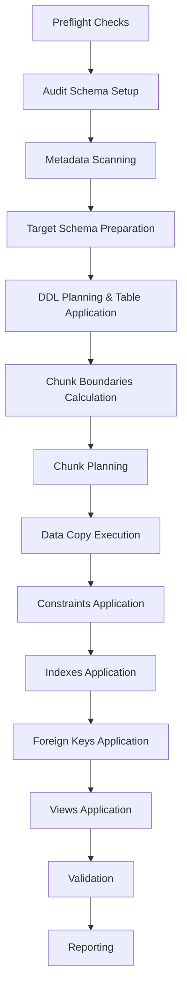

# Current Migration Architecture Review (Phase 00 Baseline)

This document provides a concrete baseline review of the Oracle-to-GaussDB migration tool's architecture, maps the current runtime execution flow, analyzes individual modules, logs observed limitations, points to specific source files where known issues manifest, and details a formal risk register.

---

## 1. Current Runtime Flow Mapping

The migration execution is controlled by the [MigrationOrchestrator.run()](../../src/main/java/com/bank/migration/orchestrator/MigrationOrchestrator.java#L93) method. The exact phase order and their runtime behaviors are detailed below:

1. **Preflight Checks** ([PreflightService](../../src/main/java/com/bank/migration/preflight/PreflightService.java)):
   - Verifies connectivity to the Oracle source (`select 1 from dual`).
   - Verifies connectivity to the GaussDB target (`select 1`).
   - Checks if the target schema contains tables or objects (if `cleanLoad` is enabled).
2. **Audit Schema Setup** ([AuditSchemaService](../../src/main/java/com/bank/migration/audit/AuditSchemaService.java)):
   - Creates the audit schema `migration_audit` on the target database if not exists.
   - Creates target tables `migration_audit.checkpoints` and `migration_audit.errors` if not exist.
3. **Metadata Scanning** ([OracleMetadataScanner](../../src/main/java/com/bank/migration/scanner/OracleMetadataScanner.java)):
   - Queries the source Oracle database system views (`all_tables`, `all_tab_columns`, `all_constraints`, `all_indexes`, `all_views`) to extract structural definition objects.
   - Assembles an in-memory `MigrationManifest`.
4. **Target Schema Preparation** ([TargetSchemaService](../../src/main/java/com/bank/migration/ddl/TargetSchemaService.java)):
   - If `cleanLoad` is enabled, drops and creates the target schema to clear existing tables/views.
5. **DDL Planning & Table Application** ([MigrationOrchestrator.run()](../../src/main/java/com/bank/migration/orchestrator/MigrationOrchestrator.java#L111-L112) calling [TableDdlPlanner](../../src/main/java/com/bank/migration/ddl/TableDdlPlanner.java) and [DdlApplier](../../src/main/java/com/bank/migration/ddl/DdlApplier.java)):
   - All table, constraint, index, and foreign key DDL statements are planned up front by `planDdl(...)` (calling `TableDdlPlanner`) before data copying begins.
   - The prebuilt `TABLE` DDL statements are immediately executed on the target database by `DdlApplier`.
6. **Chunk Boundaries Calculation** ([ChunkBoundsService](../../src/main/java/com/bank/migration/chunk/ChunkBoundsService.java)):
   - Determines the primary key column for each table.
   - Queries `min` and `max` numeric values of primary keys (or queries `count(*)` as a fallback if no single primary key column exists).
7. **Chunk Planning** ([ChunkPlanner](../../src/main/java/com/bank/migration/chunk/ChunkPlanner.java)):
   - Subdivides tables into partition ranges (chunks) based on the computed min/max bounds and the configured `chunkSize`.
8. **Data Copy Execution** ([TableMigrationTasklet](../../src/main/java/com/bank/migration/load/TableMigrationTasklet.java) & [DataCopyService](../../src/main/java/com/bank/migration/load/DataCopyService.java)):
   - Sequentially loops through tables and copy chunks.
   - Performs JDBC batch updates to insert source rows from Oracle into GaussDB.
   - Logs checkpoints and reports errors in the audit schema.
9. **Constraints Application** ([MigrationOrchestrator.run()](../../src/main/java/com/bank/migration/orchestrator/MigrationOrchestrator.java#L120-L123) and [DdlApplier](../../src/main/java/com/bank/migration/ddl/DdlApplier.java)):
   - Executes the prebuilt `CONSTRAINT` DDL statements (which were planned earlier up front) on the target database using `DdlApplier` to apply primary key and unique constraints.
10. **Indexes Application** ([MigrationOrchestrator.run()](../../src/main/java/com/bank/migration/orchestrator/MigrationOrchestrator.java#L124-L127) and [DdlApplier](../../src/main/java/com/bank/migration/ddl/DdlApplier.java)):
    - Executes the prebuilt `INDEX` DDL statements (which were planned earlier up front) using `DdlApplier` to create unique and non-unique secondary indexes on the target database.
11. **Foreign Keys Application** ([MigrationOrchestrator.run()](../../src/main/java/com/bank/migration/orchestrator/MigrationOrchestrator.java#L128-L131) and [DdlApplier](../../src/main/java/com/bank/migration/ddl/DdlApplier.java)):
    - Executes the prebuilt `FOREIGN_KEY` DDL statements (which were planned earlier up front) using `DdlApplier` to link tables via foreign keys (marked `not valid` if they were not validated on Oracle) on the target database.
12. **Views Application** ([ViewPlanner](../../src/main/java/com/bank/migration/view/ViewPlanner.java) & [ViewApplier](../../src/main/java/com/bank/migration/view/ViewApplier.java)):
    - Normalizes view SQL, flags a few Oracle-specific patterns for review, and otherwise passes original view SQL through, executing and applying only those planned with `READY` status on the target while skipping views marked as `NEEDS_REVIEW`.
13. **Validation** ([ValidationCoordinator](../../src/main/java/com/bank/migration/validate/ValidationCoordinator.java)):
    - Runs validation scripts to verify row counts, checks for duplicate unique keys, and scans for orphaned foreign key constraints.
14. **Reporting** ([ReportWriter](../../src/main/java/com/bank/migration/report/ReportWriter.java)):
    - Writes migration summary reports in JSON, CSV, and HTML formats, including run statuses, errors, and validations.

---

## 2. Module Responsibility & Limitations Mapping

| Module | Current Responsibility | Observed Limitation | Recommended Owner Phase |
| :--- | :--- | :--- | :--- |
| **preflight** | Runs connectivity checks and validates empty target. | Missing key readiness checks (e.g. disk space limits, role permissions, version validation). | Phase 01 (Safety Checks) |
| **audit** | Manages audit database schema, writes checkpoints/logs. | Error logging has graceful degradation to the filesystem report when `ErrorLogStore.save` fails, but checkpoint writes are not protected the same way and can still fail the run. Additionally, there is no manifest persistence support in audit. | Phase 01 (Audit Resilience) |
| **scanner** | Scans Oracle database catalog tables to construct manifests. | Already filtered to one schema owner; the real limitation is the lack of per-table/per-view exclusions within the selected schema. Performs unconditional rescanning in scanner/orchestrator with no manifest persistence mechanism yet. | Phase 01 (Exclusion / Filters) |
| **ddl** | Maps types and generates DDL statements for tables, keys, and indexes. | Does not double-quote identifiers or handle reserved keywords. Hardcoded SQL dialection. | Phase 01 (Escaping & Typemapping) |
| **chunk** | Queries primary key bounds and partitions table rows. | Bounds calculation assumes numeric conversion through `Long.class`, and non-numeric PKs can fail during bounds calculation or produce incompatible predicates. | Phase 01 (Non-Numeric Chunks) |
| **load** | Conducts batch copies of data chunks. | Direct pass-through of Oracle-specific LOB references causes target driver failure. | Phase 01 (LOB Streaming) |
| **validate** | Conducts post-load validation checks. | Inline hardcoded queries; could degrade performance on massive datasets. | Phase 01 (Optimized Validator) |
| **view** | Plans and deploys SQL database views. | Does not perform SQL translation or schema replacement; it only normalizes SQL and flags a few Oracle-specific patterns for review, passing the original SQL through. Complex Oracle-specific SQL constructs will fail when executed on the target database. Applies only READY views. | Phase 02 (View Translator) |
| **report** | Emits output files reporting run state. | Basic logging without deep telemetry or performance breakdown metrics. | Phase 01 (Enhanced Reports) |
| **orchestrator** | Coordinates overall lifecycle of execution. | High structural coupling; doesn't support pausing or skipping specific steps. Performs unconditional rescanning in scanner/orchestrator with no manifest persistence mechanism yet. | Phase 01 (Orchestrator Resilience) |

---

## 3. Mapping Known Issues to Code Modules

Specific locations of key architecture issues in the code are mapped below:

*   **Reserved words -> ddl/load SQL rendering**
    *   *Code Locations*: [TableDdlPlanner.java](../../src/main/java/com/bank/migration/ddl/TableDdlPlanner.java#L58-L69) (`columnSql()`), [DataCopyService.java](../../src/main/java/com/bank/migration/load/DataCopyService.java#L66-L71) (`insertSql()`).
    *   *Issue Description*: Unquoted column and table identifiers (e.g., lowercase names like `order` or `select`) are directly written to SQL strings. This causes runtime syntax errors when database identifiers clash with GaussDB reserved keywords.
*   **Unsupported Oracle types -> OracleToGaussTypeMapper**
    *   *Code Location*: [OracleToGaussTypeMapper.java](../../src/main/java/com/bank/migration/ddl/OracleToGaussTypeMapper.java#L40-L45) (`map()` switch statement default case).
    *   *Issue Description*: Maps unrecognized Oracle types to generic `text` with `needsReview() = true`. When processed, the caller [TableDdlPlanner.java](../../src/main/java/com/bank/migration/ddl/TableDdlPlanner.java#L60-L64) throws a fatal `IllegalArgumentException`, halting the entire pipeline.
*   **Numeric PK assumption -> ChunkBoundsService and ChunkPlanner**
    *   *Code Locations*: [ChunkBoundsService.java](../../src/main/java/com/bank/migration/chunk/ChunkBoundsService.java#L31-L32) (`bounds()`), [ChunkPlanner.java](../../src/main/java/com/bank/migration/chunk/ChunkPlanner.java#L34-L44) (`plan()`).
    *   *Issue Description*: Bounds calculation assumes numeric conversion through `Long.class` and non-numeric PKs can fail during bounds calculation or produce incompatible predicates.
*   **LOB pass-through -> DataCopyService**
    *   *Code Location*: [DataCopyService.java](../../src/main/java/com/bank/migration/load/DataCopyService.java#L37-L48) (`rs.getObject(column)`).
    *   *Issue Description*: Reads LOB columns as raw JDBC Objects. Oracle JDBC driver returns proprietary instances (e.g., `oracle.sql.BLOB`), which openGauss JDBC cannot serialize, crashing batch loads.
*   **Dialect mixing -> scanner/ddl/load/validate SQL strings**
    *   *Code Locations*:
        *   **scanner**: [OracleMetadataScanner.java](../../src/main/java/com/bank/migration/scanner/OracleMetadataScanner.java#L24-L75) (Oracle-specific catalog queries)
        *   **ddl**: [TableDdlPlanner.java](../../src/main/java/com/bank/migration/ddl/TableDdlPlanner.java) (GaussDB-specific `CREATE TABLE` and constraint DDL queries)
        *   **load**: [DataCopyService.java](../../src/main/java/com/bank/migration/load/DataCopyService.java#L30-L32) (`sourceSql`) and [DataCopyService.java](../../src/main/java/com/bank/migration/load/DataCopyService.java#L66-L71) (`insertSql()`)
        *   **validate**: [RowCountValidator.java](../../src/main/java/com/bank/migration/validate/RowCountValidator.java#L23-L27) (queries mixed with Oracle/GaussDB schemas), [DuplicateKeyValidator.java](../../src/main/java/com/bank/migration/validate/DuplicateKeyValidator.java), and [ForeignKeyValidator.java](../../src/main/java/com/bank/migration/validate/ForeignKeyValidator.java)
    *   *Issue Description*: Oracle and GaussDB specific SQL syntaxes and queries are hardcoded directly inside Java classes across scanner, ddl, load, and validate modules, rather than being abstractly isolated or injected. This prevents cleanly isolating or switching dialects.
*   **Exclusions missing -> MigrationProperties and manifest filtering**
    *   *Code Locations*: [MigrationProperties.java](../../src/main/java/com/bank/migration/config/MigrationProperties.java), [OracleMetadataScanner.java](../../src/main/java/com/bank/migration/scanner/OracleMetadataScanner.java#L93-L139).
    *   *Issue Description*: Config maps schemas but lacks options to exclude tables or views. The scanner extracts and attempts to migrate the entire schema database contents without filters.
*   **Manifest cache missing -> scanner/orchestrator/audit**
    *   *Code Locations*:
        *   **scanner**: [OracleMetadataScanner.java](../../src/main/java/com/bank/migration/scanner/OracleMetadataScanner.java)
        *   **orchestrator**: [MigrationOrchestrator.java](../../src/main/java/com/bank/migration/orchestrator/MigrationOrchestrator.java#L106)
        *   **audit**: [AuditSchemaService.java](../../src/main/java/com/bank/migration/audit/AuditSchemaService.java), [CheckpointStore.java](../../src/main/java/com/bank/migration/audit/CheckpointStore.java), and [ErrorLogStore.java](../../src/main/java/com/bank/migration/audit/ErrorLogStore.java)
    *   *Issue Description*: Unconditional rescanning of the source database catalog occurs in scanner/orchestrator on every run, and there is no manifest persistence support in any of the audit module classes.
*   **Readiness missing -> preflight/orchestrator/report**
    *   *Code Locations*: [PreflightService.java](../../src/main/java/com/bank/migration/preflight/PreflightService.java#L25-L31), [MigrationOrchestrator.java](../../src/main/java/com/bank/migration/orchestrator/MigrationOrchestrator.java#L102), and [ReportWriter.java](../../src/main/java/com/bank/migration/report/ReportWriter.java).
    *   *Issue Description*: Checks connectivity but omits structural and system readiness indicators (disk capacity, target database user privileges) in preflight, execution flow, and final migration reports.

---

## 4. Phase-One Boundaries Confirmation

> [!IMPORTANT]
> **Strict Out-of-Scope Constraints**
> Phase-one of this migration tool handles tables, data chunks, standard views, indexes, primary keys, and foreign keys. It does **not** support migrating:
> - **Database Triggers**
> - **Stored Procedures**
> - **Database Functions**
> - **PL/SQL Packages**
> - **Database Jobs & Schedulers**
> - **Materialized Views**
> 
> Any attempt to scan or plan these objects must be explicitly filtered out or designated for manual DBA migration.

---

## 5. Risk Register

The migration tool faces the following architectural and runtime risks:

| ID | Description | Severity | Detection | Mitigation | Should Stop Migration |
| :--- | :--- | :--- | :--- | :--- | :--- |
| **RSK-01** | **Unsupported Types Halt Execution:** Undefined Oracle types (e.g. `XMLTYPE`) cause the DDL planner to throw runtime exceptions. | High | Fatal `IllegalArgumentException` thrown during DDL planning. | Allow type mapping configurations and schema/column level exclusions. | Yes |
| **RSK-02** | **Identifier SQL Collisions (Reserved Words):** Direct concatenation of database identifiers matching GaussDB reserved keywords causes SQL syntax exceptions. | High | Target DB throws `SyntaxErrorException` upon DDL or insert execution. | Double-quote all database column and table names in SQL rendering templates. | Yes |
| **RSK-03** | **Non-Numeric Primary Keys Cause Bounds/Predicate Failure:** Bounds calculation assumes numeric conversion through `Long.class` and non-numeric PKs can fail during bounds calculation or produce incompatible predicates. | High | Failure during bounds calculation or database query exceptions due to incompatible predicates. | Implement a ROWID-based query splitter or hash partitioner for string-based keys. | Yes |
| **RSK-04** | **LOB Serialization Failure:** Passing Oracle-specific LOB instances directly to the GaussDB JDBC batch execution causes serialization exceptions. | Critical | JDBC driver throws type-translation errors during data load. | Read LOB columns as standard bytes or streams and pass them as native byte arrays/strings. | Yes |
| **RSK-05** | **Target Schema Space Exhaustion:** Tool begins large data copying without verifying if the target database has adequate capacity, resulting in mid-copy crashes. | High | Database writes fail mid-migration with target "disk full" error. | Estimate source schema size during scan and compare against target disk capacity in preflight checks. | Yes |
| **RSK-06** | **Dialect Coupling Maintenance Drag:** Mixed SQL dialects scattered across Java files complicate future maintenance or driver upgrades. | Medium | Code modification in DB drivers or schema structures requires massive changes across many files. | Separate query templates and database-specific logic into distinct dialect classes. | No |
| **RSK-07** | **Performance Bottlenecks on Large Schemas:** Continual live Oracle catalog queries degrade startup execution performance on dense schemas. | Medium | High CPU/I/O load on Oracle, and long execution delays before DDL application. | Serialize scan results to a local file cache for reuse across runs. | No |
